# AI_ka_chilla_2023
This repository is about the Course AI ka chilla 2023 #aikachilla. A Paid course. 

The price of this course for Pakistani people is 5000 PKR and for international students is 50 USD.

> `This is a recorded course and you will provided each and every code to learn and practice.`

To buy this course, email us at info@codanics.com or visit our [fiverr account](https://www.fiverr.com/codanics?up_rollout=true). 

<!-- To register for AI ka chilla 2023, fill this google form: https://forms.gle/ZPXSXEcLQnfha7xw8  -->

Here is the complete poster of the course:\

## **Information about the instructor:**

**Dr. Muhammad Aammar Tufail**

PhD Data Science in Agriculture

For any query

contact: aammar@codanics.com

## **Our youtube channel**

- [AI\_ka\_chilla\_2023](#ai_ka_chilla_2023)
  - [**Information about the instructor:**](#information-about-the-instructor)
  - [**Our youtube channel**](#our-youtube-channel)
  - [**Resources**](#resources)
    - [*Books* (I will keep updating this list, if you have any book that you think should be added in this list, please let me know via telegram or email)](#books-i-will-keep-updating-this-list-if-you-have-any-book-that-you-think-should-be-added-in-this-list-please-let-me-know-via-telegram-or-email)
  - [**Lecture No. 0: Pre-requisite of this course:**](#lecture-no-0-pre-requisite-of-this-course)
  - [Final Day: `Reviews from Students`](#final-day-reviews-from-students)
  - [**Our youtube channel**](#our-youtube-channel-1)

## **Resources**
### *Books* (I will keep updating this list, if you have any book that you think should be added in this list, please let me know via telegram or email)

* [Python for Data Analysis](https://wesmckinney.com/book/)
* [Python Data Science Handbook](https://jakevdp.github.io/PythonDataScienceHandbook/)
* [Statistics for Data Scientists](./resources/books/statistics%20for%20data%20science.pdf)
* [Hands-On Machine Learning with Scikit-Learn, Keras, and TensorFlow 2nd Edition](./resources/books/Hands-On-Machine-Learning-with-Scikit-Learn-Keras-and-Tensorflow_-Concepts-Tools-and-Techniques-to-Build-Intelligent-Systems-OReilly-Media-2019.pdf)
* [Hands-On Machine Learning with Scikit-Learn, Keras, and TensorFlow 3rd Edition](https://pan.baidu.com/s/1SyPW8cAvoDDNwdaWdN9E0A?pwd=g3ma#list/path=%2F)

## **Lecture No. 0: Pre-requisite of this course:**

Is lecture ko complete kiay bina ap agay nahi chal saken gay is course ko start karne se pehlay ye 11 hours ka lectures zaroor sunen or practice karen, phir agay chalen, warna masla ho ga.

>[Pre-requisite lecture link is here](https://www.youtube.com/live/xjTMkxVSSxg?feature=share)

## Final Day: `Reviews from Students`

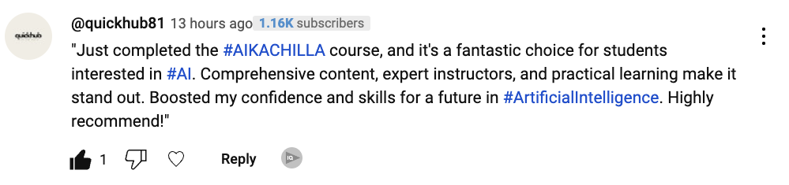
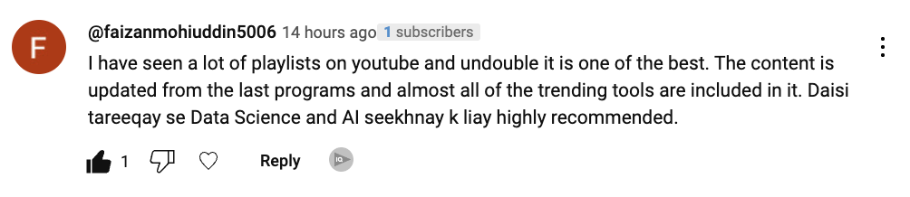
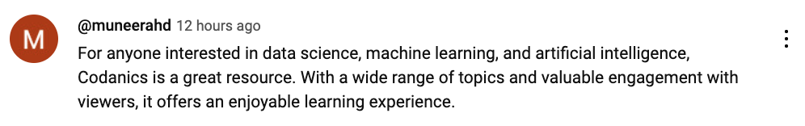
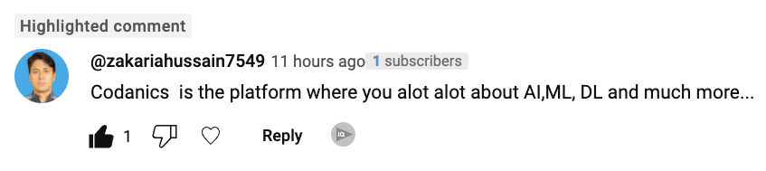

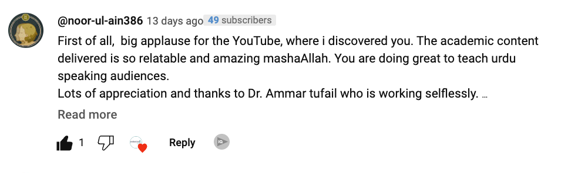

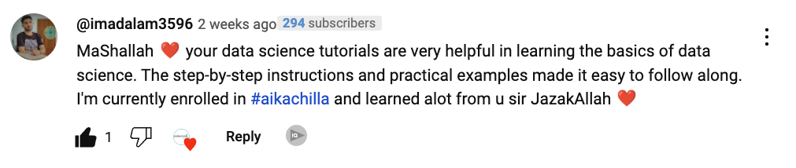
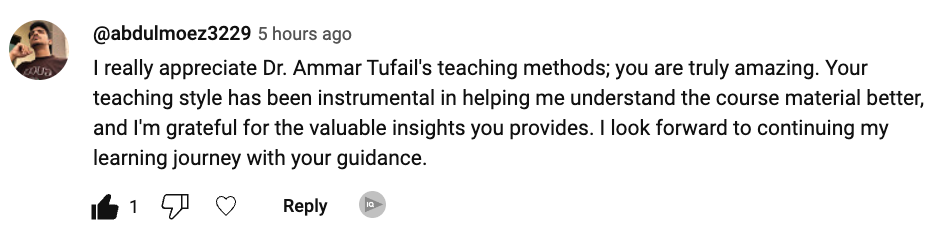
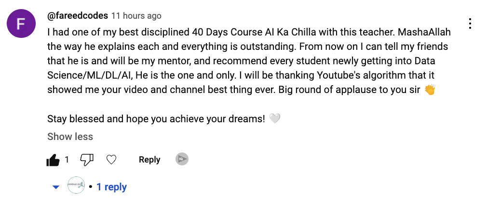
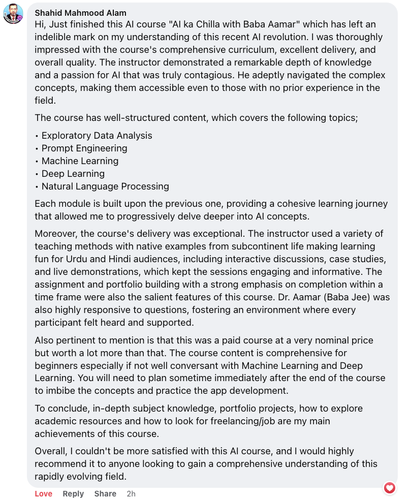
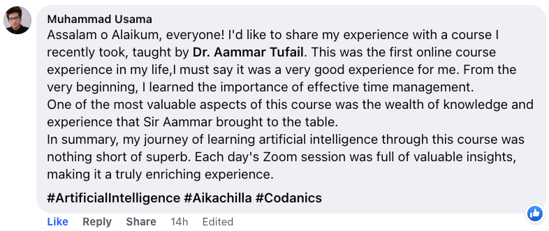
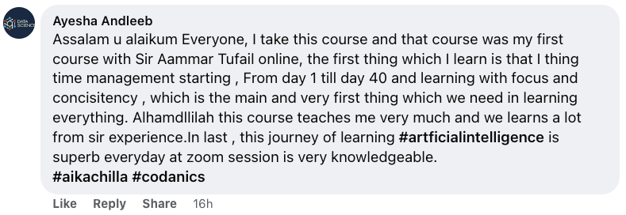
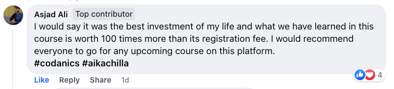

---
---
---

**Dr. Muhammad Aammar Tufail**

PhD Data Science in Agriculture

For any query

contact: aammar@codanics.com

## **Our youtube channel**

visit our website for more details:
[www.codanics.com](https://www.codanics.com/)

---