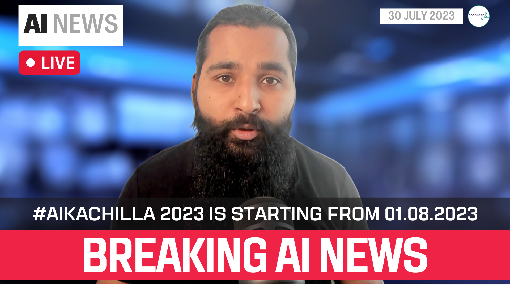

# AI_ka_chilla_2023
This repository is about the Course AI ka chilla 2023 #aikachilla. A Paid course. To register for AI ka chilla 2023, fill this google form: https://forms.gle/ZPXSXEcLQnfha7xw8  

Here is the complete poster of the course:

## **Resources**
### *Books* (I will keep updating this list, if you have any book that you think should be added in this list, please let me know via telegram or email)

* [Python for Data Analysis](https://wesmckinney.com/book/)
* [Python Data Science Handbook](https://jakevdp.github.io/PythonDataScienceHandbook/)
* [Statistics for Data Scientists](./resources/books/statistics%20for%20data%20science.pdf)
* [Hands-On Machine Learning with Scikit-Learn, Keras, and TensorFlow 2nd Edition](./resources/books/Hands-On-Machine-Learning-with-Scikit-Learn-Keras-and-Tensorflow_-Concepts-Tools-and-Techniques-to-Build-Intelligent-Systems-OReilly-Media-2019.pdf)
* [Hands-On Machine Learning with Scikit-Learn, Keras, and TensorFlow 3rd Edition](https://pan.baidu.com/s/1SyPW8cAvoDDNwdaWdN9E0A?pwd=g3ma#list/path=%2F)

## **Lecture No. 0: Pre-requisite of this course:**

Is lecture ko complete kiay bina ap agay nahi chal saken gay is course ko start karne se pehlay ye 11 hours ka lectures zaroor sunen or practice karen, phir agay chalen, warna masla ho ga.

>[Pre-requisite lecture link is here](https://www.youtube.com/live/xjTMkxVSSxg?feature=share)

---
## 1. Introduction to the 40 Days long course:

Here is the complete lecture, click the image and watch the lectrue in Urdu/Hindi.

---
## 2. AI News 21-07-2023:

Here is the complete lecture, click the image and watch the lectrue in Urdu/Hindi.

---
## 3. AI News 30-07-2023:

Here is the complete lecture, click the image and watch the lectrue in Urdu/Hindi.

## 4. What is Artificial Intelligence:

Here is the complete lecture, click the image and watch the lectrue in Urdu/Hindi.

---
## 5. History of Artificial Intelligence:

Here is the complete lecture, click the image and watch the lectrue in Urdu/Hindi.

>Here is the link for reference: [History of AI](https://sitn.hms.harvard.edu/flash/2017/history-artificial-intelligence/)

---
## 6. Big players in AI:

Here is the complete lecture, click the image and watch the lectrue in Urdu/Hindi.

---
## 7. AI in our Daily life:

Here is the complete lecture, click the image and watch the lectrue in Urdu/Hindi.

---
## 8. How to get a job in AI:

Here is the complete lecture, click the image and watch the lectrue in Urdu/Hindi.

---
## 9. Will me job be replaced by AI?:

Here is the complete lecture, click the image and watch the lectrue in Urdu/Hindi.

---
## 10. Main Goals of AI ka Chilla 2023:

Here is the complete lecture, click the image and watch the lectrue in Urdu/Hindi.

---
## 11. Why Do you need to learn pyhton for AI?

Here is the complete lecture, click the image and watch the lectrue in Urdu/Hindi.

---
## 12. Software installation and websites for this course:

Here is the complete lecture, click the image and watch the lectrue in Urdu/Hindi.

>**`Links to software and websites:`**
>1. Python: https://www.python.org/downloads/
>2. vscode: https://code.visualstudio.com/
>3. miniconda: https://docs.conda.io/en/latest/miniconda.html#installing
>4. git: https://git-scm.com/

>**`Website links to make your account on (sign up):`**
>* github: https://github.com/
>* github student developer pack: https://education.github.com/pack
>* git hub teachers developer pack: https://education.github.com/teachers
>* kaggle: https://www.kaggle.com/muhammadaammartufail
>* LinkedIn: https://www.linkedin.com/in/dr-muhammad-aammar-tufail-02471213b/
>* Twitter (X): https://twitter.com/aammar_tufail
>* Use multiple gpt algorithms: https://poe.com/
>* youtube:  https://www.youtube.com/@Codanics

---
## 13. Conda environemnts (A-Z):

Here is the complete lecture, click the image and watch the lectrue in Urdu/Hindi.

")

> Here is the cheatsheet for conda commands: [Conda cheatsheet](https://docs.conda.io/projects/conda/en/4.6.0/_downloads/52a95608c49671267e40c689e0bc00ca/conda-cheatsheet.pdf)

---
## 14. VScode setup for python for AI and Data Science:

Here is the complete lecture, click the image and watch the lectrue in Urdu/Hindi.

---

## **15.** **Basics of Python for AI and Data Science:**

**`Python-101`**
>**Note:** Please watch the following lecture and practice at least 5 times before moving to the next lectures: [Python-101](https://youtu.be/930zolu8E2g)

### 15.1. Python-101 (Part-1): *`First Line of Code in Python`*

Here is the complete lecture, click the image and watch the lectrue in Urdu/Hindi.

* [Book: Python for Data Analysis](https://wesmckinney.com/book/)

### 15.2 Python-101 (Part-2): *`Variables in Python`*

Here is the complete lecture, click the image and watch the lectrue in Urdu/Hindi.

### 15.3 Python-101 (Part-3): *`Operator in python`*

Here is the complete lecture, click the image and watch the lectrue in Urdu/Hindi.

### 15.4 Python-101 (Part-4): *`Data Types in Python`*

Here is the complete lecture, click the image and watch the lectrue in Urdu/Hindi.

### 15.5 Python-101 (Part-5): *`Indentations and if conditions in Python`*

Here is the complete lecture, click the image and watch the lectrue in Urdu/Hindi.

### 15.6 Python-101 (Part-6): *`User input program in python`*

Here is the complete lecture, click the image and watch the lectrue in Urdu/Hindi.

### 15.7 Python-101 (Part-7): *`Data structures and indexing in python`*

Here is the complete lecture, click the image and watch the lectrue in Urdu/Hindi.

### 15.8 Python-101 (Part-8): *`Control flow statements in python`*

Here is the complete lecture, click the image and watch the lectrue in Urdu/Hindi.

### 15.9 Python-101 (Part-9):*`Nested Loops in Python`*

Here is the complete lecture, click the image and watch the lectrue in Urdu/Hindi.

### 15.10 Python-101 (Part-10): *`Functions & Lmbda funtions in Python`*

Here is the complete lecture, click the image and watch the lectrue in Urdu/Hindi.

### 15.11 Python-101 (Part-11): *`Modules and Libraries in Python`*

Here is the complete lecture, click the image and watch the lectrue in Urdu/Hindi.

### 15.12 Python-101 (Part-12): *`Types of Errors in Python`*

Here is the complete lecture, click the image and watch the lectrue in Urdu/Hindi.

### 15.13 Python-101 (Part-13): *`Jupyter Notebook and File Handling in Python`*

Here is the complete lecture, click the image and watch the lectrue in Urdu/Hindi.

### 15.14 Python-101 (Part-14): *`MarkDown Crash Course in 72 minutes`*

Here is the complete lecture, click the image and watch the lectrue in Urdu/Hindi.

---
## **16.** **Why Data is Important for AI?**

Here is the complete lecture, click the image and watch the lectrue in Urdu/Hindi.

---

## **17.** **How Data is fueling AI:**

Here is the complete lecture, click the image and watch the lectrue in Urdu/Hindi.

---

## **18** **ABC of Statistics for AI and Data Science:**

### 18.1. ABC of Statistics (Part-1): *`Introduction to Statistics`*

Here is the complete lecture, click the image and watch the lectrue in Urdu/Hindi.

### 18.2. ABC of Statistics (Part-2): *`Data and Stat`*

Here is the complete lecture, click the image and watch the lectrue in Urdu/Hindi.

### 18.3. ABC of Statistics (Part-3): *`Data, Stat and Data`*

Here is the complete lecture, click the image and watch the lectrue in Urdu/Hindi.

### 18.4. ABC of Statistics (Part-4): *`Descriptive Statistics`*

Here is the complete lecture, click the image and watch the lectrue in Urdu/Hindi.

### 18.5. ABC of Statistics (Part-5): *`Inferential Statistics Part-1`*

Here is the complete lecture, click the image and watch the lectrue in Urdu/Hindi.

### 18.6. ABC of Statistics (Part-6): *`Inferential Statistics Part-2`*

Here is the complete lecture, click the image and watch the lectrue in Urdu/Hindi.

### 18.7. ABC of Statistics (Part-7): *`Hypothesis Testing`*

Here is the complete lecture, click the image and watch the lectrue in Urdu/Hindi.

### 18.8. ABC of Statistics (Part-8): *`Important Terms in Statistics`*

Here is the complete lecture, click the image and watch the lectrue in Urdu/Hindi.

---

## **19.** **Exploratory Data Analysis in Python:**

### 19.1. EDA (Part-1): *`Introduction to EDA and Python coding`*

Here is the complete lecture, click the image and watch the lectrue in Urdu/Hindi.

### 19.2. EDA (Part-2): *`Important Terminoogies in EDA`*

Here is the complete lecture, click the image and watch the lectrue in Urdu/Hindi.

### 19.3. EDA (Part-3): *`Why and how to deal missing values`*

Here is the complete lecture, click the image and watch the lectrue in Urdu/Hindi.

---
